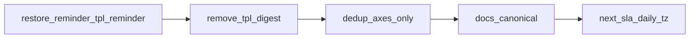

# Notifications schedule flexibility — сводный план

## Как «разжевать» старые три предложения (простым языком)

Это были не новые фичи, а **организационные советы**, как не застрять:

1. **«Зафиксировать дедуп в одном абзаце»** — имелось в виду: *до кодирования* записать одной фразой правило «что считаем повтором и что — новым событием», чтобы не переделывать три раза. Сейчас это согласовано: **в ядре нет «редких повторов по TTL»**; **напоминание по времени застоя** — отдельный механизм **правил** (следующий прогон).

2. **«Один канонический документ для операторов»** — не плодить пять разрозненных TZ с противоречиями; одна страница «как живут политики, профиль, DND, ссылки issue_url». Остальное — архив или ссылка на неё.

3. **«Один проход по хвостам»** — не чинить `BotIssueState`, сиды и docstrings пятью крошечными PR; лучше **список в одном спринте**, чтобы контекст не терялся.

## Решения владельца продукта (зафиксировано)

### Дедуп и «редкие повторы»

- **Повторы по таймеру** и сценарий «статус долго не менялся → отправить» делаются **через будущие правила** (настраиваемые статусы, интервал, тип уведомления — **любой**, по умолчанию админ выберет **reminder**, получатели выбираются). **В текущем прогоне не реализуется.**
- Слой дедупа **new/issue_updated** в ядре: **подавление повторов до значимого изменения** (оси задачи / см. спеку при реализации), **без** отдельного TTL-«добора» в этом же слое.

### Шаблоны и типы

- **`tpl_reminder` удалять нельзя** — это **регресс**: нужно **вернуть** тип `reminder` в [`NOTIFICATION_TYPES`](src/bot/logic.py) и запись в [`EVENT_TO_TEMPLATE`](src/bot/notification_template_routing.py) → `tpl_reminder`, плюс реестры/тесты `assert_event_map_covers_notification_types`. Отправка срабатыванием **старого** reminder_service не возвращается; отправка из **новых правил** — в следующем прогоне.

- **`tpl_digest`** — см. раздел «Удаление tpl_digest навсегда».

### Удаление tpl_digest навсегда

Цель: **полное исчезновение** концепта из продукта и репозитория.

- **Код:** [`template_loader`](src/bot/template_loader.py), [`notification_template_repo`](src/database/notification_template_repo.py), [`notification_templates.py`](src/admin/routes/notification_templates.py) (превью/ветвления), любые `rg tpl_digest` / `digest_items` в `src/` и `tests/`.
- **Файлы шаблонов:** удалить `templates/bot/tpl_digest*.j2` (и аналоги), если есть.
- **Документация:** вычистить или переписать упоминания `tpl_digest` / дайджест-шаблона как актуального продукта.
- **БД:** новая ревизия Alembic — **DELETE** из `notification_templates` где `name = 'tpl_digest'` (миграция должна быть безопасной при отсутствии строк). Обратимый **downgrade** — по согласованию (часто для seed-шаблона достаточно no-op downgrade или комментарий «восстановление вручную»).

После шага — **команды пользователю** (pytest, при необходимости `alembic upgrade head`).

### Утренний отчёт

- **`daily_report` не выпиливать.** **Следующая итерация:** связка с **таймзонами пользователей** и семантика **«выбрал 23:59 — пришло ровно в это время»** (локаль/выбранная зона — уточнить при проектировании).

### Очередь digest

- Накопление/дренаж при DND — по ТЗ снято; шаблон **tpl_digest** — удаляется полностью (см. выше).

## Дедуп new/issue_updated (спецификация для реализации)

Охват **только** типов уведомления **`new`** и **`issue_updated`** (именно ключ после политики / `EVENT_TO_TEMPLATE`, до выбора tpl). Типы вроде `status_change`, `info`, `reminder` и т.д. **не входят** в этот дедуп (каждый шлётся по своим правилам политик).

**Цель:** при одном и том же «смысловом срезе» задачи не спамить Matrix повторными `new` / `issue_updated` в одну и ту же комнату из‑за серии журналов с неизменными осями. Агрегация журналов в pipeline остаётся первой линией защиты; дедуп — **вторая**, на уровне «решили слать в room X».

**Гранулярность ключа:** тройка `(issue_id, room_id, notification_type)`, где `notification_type ∈ {new, issue_updated}`. Отдельная запись состояния для каждой пары комната×тип.

**Отпечаток осей задачи (fingerprint):** три идентификатора, согласованных с [`routing._issue_axis_ids`](src/bot/routing.py):

- `status.id` (или `None`, если нет статуса);
- `fixed_version.id` или `target_version.id`, что используется у issue как версия (как в маршрутизации);
- `priority.id` (или `None`).

Нормализация: сравнение по целочисленным id (или согласованное представление «нет»), без имён из справочников.

**Правило подавления:**

- Перед отправкой (после всех gate: политика, пересечение профиля, DND/расписание — **если дошли до попытки отправки**) для пары `(issue_id, room_id, ntype)` при `ntype ∈ {new, issue_updated}`:
  - вычислить текущий fingerprint;
  - если он **совпадает** с сохранённым «последним отправленным» fingerprint для этой тройки — **не отправлять** (лог debug);
  - если **не совпадает** или записи ещё нет — **отправить** и **атомарно обновить** сохранённый fingerprint после успешной доставки.

**Когда обновлять сохранённый fingerprint:** после **успешного** `room_send` (или эквивалента), чтобы при ошибке сети повтор тика мог повторить попытку. Если доставка уходит **только** в DLQ с готовым payload без send — зафиксировать в спеке при кодировании (рекомендация: обновлять fingerprint и при успешной постановке в DLQ для «готового тела», чтобы не бесконечно плодить DLQ-батчи при тех же осях; альтернатива — не обновлять и принимать дубликаты в DLQ — **выбрать одно поведение в коде и отразить в тесте**).

**Сброс (новый «смысловой интервал»):** любое изменение хотя бы одного из трёх id в fingerprint по сравнению с сохранённым — считается новым интервалом, отправка снова разрешена.

**Вне охвата (явно):**

- повторы по таймеру без смены осей — только **future-policy-reminder-sla**;
- отдельный TTL «редкого повтора» в ядре журнала — **нет**.

**Хранение:** использовать существующее [`BotIssueState`](src/database/models.py) / [`state_repo`](src/database/state_repo.py) (JSON-блок журналов/sent или отдельное поле под «последний fingerprint по типам new/issue_updated на комнату»). Новая миграция — только если нужны столбцы; предпочтительно не плодить схему без необходимости.

**Тесты:** минимум два сценария — (1) два тика с одинаковыми осями → одно сообщение в комнату; (2) смена статуса между тиками → второе сообщение. Плюс раздельно `new` vs `issue_updated` на одну комнату, если политика теоретически выдаст оба (граничный случай).

## Дисциплина проверок для исполнителя

После каждого смыслового блока изменений **не запускать** ruff/pytest/mypy/alembic самостоятельно. Выдать пользователю **нумерованные команды** из корня репо (как CI). Итог — по ответу пользователя.

## Рекомендуемый порядок (обновлён)

1. **Восстановить `reminder` / `tpl_reminder`** (регресс) → команды пользователю.
2. **Удалить `tpl_digest` полностью** (код, диск, docs, тесты, Alembic) → команды пользователю.
3. **Спека + реализация дедупа** new/issue_updated (без TTL-повторов) → команды пользователю.
4. **Документация:** пересечение политика×профиль; runbook без ROUTING_ENGINE legacy; пометки про daily_report следующей итерацией.
5. **Админка:** overlap_warning; при необходимости — хвосты ORM под будущие правила.
6. **Следующий прогон:** правила SLA/reminder + **daily_report** с таймзонами.

## Факт по коду (регресс tpl_reminder)

В [`NOTIFICATION_TYPES`](src/bot/logic.py) сейчас **нет** ключа `reminder`; [`EVENT_TO_TEMPLATE`](src/bot/notification_template_routing.py) его не содержит — `assert_event_map_covers_notification_types` это «поддерживает». Для админки и будущих правил тип и шаблон нужно **вернуть**.
