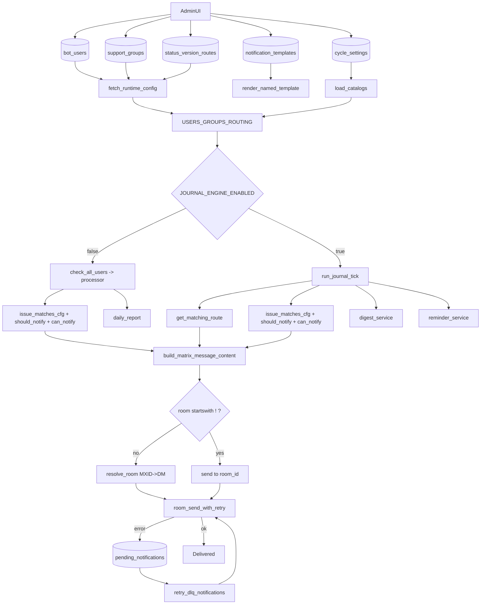

# Аудит связей уведомлений Via

Дата: 2026-04-21
Объём: полный сквозной аудит цепочки `UI -> DB -> runtime -> routing/filtering -> template -> send/DLQ`

## 1. Executive Summary

Выявлены ключевые точки, где у операторов возникает ощущение "потери связи":

1. Логика `Pre-warm DM` работает только для MXID (`@...`) и не является проверкой доставки в групповые комнаты `!room`.
2. В текущем коде существует две логики доставки (`legacy` и `journal`), а поведение по статусу `Информация предоставлена` зависит от активного контура.
3. Поле `notify` используется одновременно как список типов уведомлений и как фильтр статусов (backward-compat), что затрудняет прогнозируемость матчинга.
4. В логах есть дублирование сообщений (каждая строка повторяется), что мешает диагностике и может маскировать реальные проблемы.

Критичность:
- P1: неоднозначная интерпретация `notify` и расхождение ожиданий legacy/journal.
- P2: наблюдаемость (логи без явного decision-trace, дублирование логов).
- P3: терминологическая путаница (`DM found` интерпретируется как проверка групповых комнат).

## 2. Ограничения и источники данных baseline

### Что зафиксировано фактически

- Использован runtime лог бота: `data/bot.log`.
- Для периода инцидента подтверждён старт с 8 пользователями и prewarm на 8 MXID:
  - `✅ Matrix sync: 63 комнат загружено`
  - `🔗 Pre-warm DM: 0 в кеше, 8 нужно резолвить...`
  - `✅ Pre-warm DM завершён: 8 найдено...`
  - `✅ Планировщик ... пользователей: 8`
- Подтверждена активность отправок `status_change` и `issue_updated` в `!room`:
  - пример: `📨 #65313 -> !EAAT... (status_change)`
  - пример: `📨 #65313 -> !EAAT... (issue_updated)`

### Техническое ограничение среды аудита

В текущем окружении агента `DATABASE_URL` не задан, поэтому прямой SQL-срез таблиц prod из этой сессии невозможен. Для полного prod baseline нужен запуск тех же выборок в окружении контейнера/инстанса, где задан `DATABASE_URL`.

## 3. Карта связей UI -> DB -> Runtime

### Пользователи

- UI (`admin/routes/users.py`) пишет:
  - `room`, `notify`, `versions`, `priorities`, `timezone`, `work_hours`, `work_days`, `dnd`, `group_id`.
- DB (`database/models.py`):
  - `bot_users.room`, `bot_users.notify`, `bot_users.versions`, `bot_users.priorities`, `bot_users.*time*`, `bot_users.dnd`.
- Runtime (`database/load_config.py` -> `bot/config_state.py`):
  - `USERS[]` с прямым переносом атрибутов + `group_delivery`.

### Группы

- UI (`admin/routes/groups.py`) пишет:
  - `support_groups.room_id`, `notify/versions/priorities`, `work_hours/work_days/dnd`.
- Runtime:
  - `GROUPS[]` и для пользователей `group_delivery` через `user_orm_to_cfg`.

### Маршруты

- Статусные маршруты: `status_room_routes`.
- Глобальные маршрут по версии: `version_room_routes`.
- Персональные/групповые маршруты по версии: `user_version_routes`, `group_version_routes`.
- Runtime сборка:
  - `ROUTING["status_routes"]`, `ROUTING["version_routes_global"]`
  - `USERS[*].version_routes` (merge user + group version routes).

### Шаблоны

- Дефолт: `templates/bot/tpl_*.html.j2`.
- Override: `notification_templates.body_html/body_plain`.
- Рендер: `template_loader.render_named_template`.

## 4. Матрица идентификаторов Matrix (`@` vs `!`)

- `@user:server`:
  - трактуется как MXID;
  - в `sender._resolve_room_id` резолвится до DM room id (поиск/создание);
  - участвует в `prewarm_dm_rooms`.
- `!room:server`:
  - трактуется как готовый room id;
  - отправка напрямую без DM create;
  - `prewarm_dm_rooms` такие значения игнорирует.

Вывод: отсутствие `DM найден` для `!room` не означает проблему доставки в групповую комнату.

## 5. Блок-схема фактического потока

## 6. Decision Trace (контрольные сценарии)

### 6.1 Core: статус `Информация предоставлена`

- Legacy контур:
  - в `processor.py` ветка `issue.status.name == STATUS_INFO_PROVIDED`;
  - решение через `decide_info_reminder`;
  - первое уведомление типом `info`, далее `reminder`.
- Journal контур:
  - прямой ветки `info` нет;
  - события идут через journal handlers как `issue_updated/status_change/...`.

Риск: ожидание оператора "должен прийти info" не совпадает с активным движком.

### 6.2 Core: отправка в group room

- Route выбирается в `routing.get_matching_route` (status/version/group fallback).
- Далее фильтры `_cfg_for_room` + `issue_matches_cfg` + `should_notify` + `can_notify`.
- Отправка в `!room` идёт напрямую (без DM-resolve).

Риск: админ создал/пригласил бота в комнату, но эта комната не попадает в выбранный маршрут, либо отфильтровалась `_cfg_for_room`/`issue_matches_cfg`.

### 6.3 Core: персональный DM

- `room` пользователя может храниться как `@mxid` или `!room`.
- Для `@...` резолв до DM в `resolve_room`.
- В логе подтверждён prewarm для 8 MXID.

### 6.4 Периферия: digest

- При DND запись копится в `pending_digests` (`digest_repo.insert_digest`).
- Drain выполняется `digest_service.drain_pending_digests` для пользователей без DND.
- Шаблон `tpl_digest`, fallback plain из html.

Риск: оператор не видит мгновенных сообщений и воспринимает это как потерю, хотя они в digest-очереди.

### 6.5 Периферия: reminder

- Legacy: `decide_info_reminder` + `send_safe(..., "reminder")`.
- Journal: `reminder_service.process_reminders` + `tpl_reminder`, счётчики `MAX_REMINDERS`.

Риск: разные условия старта/остановки reminder в разных контурах.

### 6.6 Периферия: daily report

- Планировщик `scheduler.daily_report` по cron, включение через `DAILY_REPORT_ENABLED`.
- Рендер `tpl_daily_report`, отправка в персональную комнату.
- В логах есть `📊 Утренний отчёт включен...` и события запуска отчёта.

### 6.7 Периферия: DLQ retry

- Первичная ошибка -> `pending_notifications`.
- Retry: `retry_dlq_notifications` (экспоненциальная задержка, лимит попыток).

Наблюдение: в текущем лог-срезе явных DLQ строк мало/нет, нужен целевой тест с принудительным fail для полной трассировки.

## 7. Найденные разрывы связи и риски

## P1: Двуcмысленность `notify`

`logic.should_notify` и `logic.issue_matches_cfg` содержат backward-compat режим, где `notify` может быть и типами уведомлений, и статусными ключами. Это создаёт неочевидное поведение при смешанных настройках.

Рекомендация:
- Разделить хранение на два явных поля: `notify_types` и `status_filters`.
- Отключить implicit-режим по `unknown token`.
- Добавить audit-лог "почему отфильтровано".

## P1: Расхождение ожиданий между legacy/journal

Один и тот же бизнес-кейс (`Информация предоставлена`) в разных контурах порождает разные типы уведомлений и разный маршрут обработки.

Рекомендация:
- В UI явно показывать активный движок (`JOURNAL_ENGINE_ENABLED`) и матрицу событий.
- В документации закрепить event mapping для каждого режима.

## P2: Недостаточная наблюдаемость decision path

Нет единого структурированного лога по шагам `route selected -> filter result -> template -> send`.

Рекомендация:
- Ввести `decision_trace_id` на тик/событие.
- Логировать ключевые решения одной строкой JSON.

## P2: Дублирование логов

Линии в `bot.log` повторяются (2 раза), что усложняет диагностику и расчёт метрик.

Гипотеза:
- Повторная инициализация handler-ов logger без guard.

Рекомендация:
- Перед `addHandler` проверять наличие handler того же типа/target.
- Либо централизовать настройку через `logging_config`.

## P3: Ошибочная интерпретация prewarm

`Pre-warm DM` диагностирует только DM путь по MXID и не подтверждает групповую доставку в `!room`.

Рекомендация:
- В логах явно разделить:
  - `DM prewarm summary`;
  - `group room availability summary` (join/cache check).

## 8. Рекомендованные исправления (приоритетный бэклог)

1. Добавить endpoint/инструмент "Explain notification decision":
   - вход: `issue_id`, `user/group`, `room`, `engine`;
   - выход: весь decision trace.
2. Явно разделить модель фильтров:
   - `notify_types` отдельно от `status_filters`.
3. Унифицировать матрицу событий:
   - legacy и journal должны иметь документированную и сопоставимую схему.
4. Расширить runtime диагностику:
   - лог причины skip (по какому фильтру).
5. Исправить дублирование логов.

## 9. Что дополнительно нужно для 100% prod baseline

Для полного аудита на проде дополнительно выполнить SQL-срез:

- `bot_users` (кол-во, room типы `@`/`!`, notify/versions/priorities).
- `support_groups`, `status_room_routes`, `version_room_routes`, `user_version_routes`, `group_version_routes`.
- `cycle_settings` (особенно `JOURNAL_ENGINE_ENABLED`, интервалы, daily, reminder).
- `pending_digests`, `pending_notifications` (актуальные очереди).

И сверить с логами отправок на том же интервале времени.
